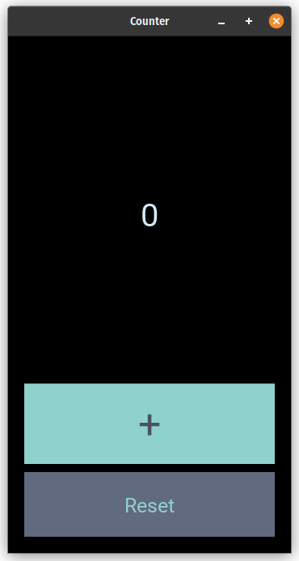

# SimpleKivyCounter
Counter written in Python using Kivy

* Written 100% in Python
* Easy to install
* Offline
* Tested on common operating systems
---
## Tested On
- Linux (Kali, Pop!_OS)
- Windows (Windows 10, Windows 11)
- MacOS (macOS Big Sur)
---
## How To Install
1. `git clone https://github.com/parhamTheDeveloper/KivyCounter.git`
2. `python -m pip install -r requirements.txt` or `python3 -m pip install -r requirements.txt`
3. `cd KivyCounter`
4. `python main.py` or `python3 main.py`
---
---
## Used Resources:
- Icon: <a href="https://www.flaticon.com/free-icons/counter" title="counter icons">Counter icons created by Freepik - Flaticon</a>
